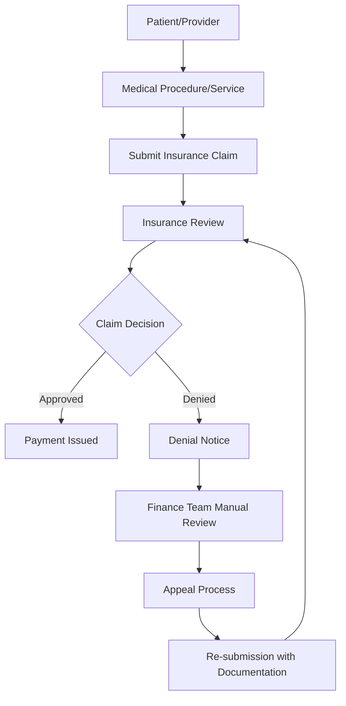
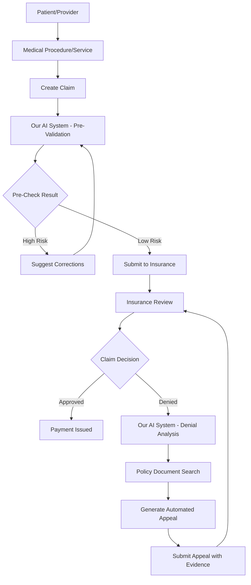

# TechUp 2025 - The BattleBots - Intelligent Claims Optimization System

**Team Lead:** Nick Akincilar  
**Team Members:** Brendan Schultz, Fady Heiba, Jack Roche, Michael Costner, Nick Akincilar

## Project Overview

An intelligent orchestration system that helps healthcare finance teams and insurance providers optimize claims processing to reduce claims denials. Our solution uses AI-powered analysis to validate claims against insurance policy documents, identify potential issues before submission, and generate automated appeals with supporting documentation.

**Vision:** Create a one-stop shop for any sort of insurance claim optimization - applicable to healthcare, auto, homeowners, and other insurance types.

## The Insurance Claims Challenge

### Current Insurance Flow (What We Learned)



### Key Problems Identified
1. **High Denial Rates**: Claims often denied due to incorrect coding, missing documentation, or misinterpretation of policy rules
2. **Manual Appeals Process**: Finance teams spend significant time manually reviewing denials and crafting appeals
3. **Complex Policy Matching**: Difficulty matching claim details against complex insurance policy documents
4. **Revenue Loss**: Denied claims represent lost revenue that requires time-intensive recovery processes

## Our Solution: Intelligent Claims Optimization

### What Our Project Does in the Flow

Our system intercepts and enhances the claims process at multiple points:

1. **Pre-Submission Validation**: Analyze claims before submission to predict approval likelihood
2. **Denial Analysis**: Automatically process denial notices to identify root causes
3. **Policy Matching**: Use AI to match claim details against insurance policy documents
4. **Automated Appeals**: Generate appeals with supporting documentation and policy references

### Enhanced Flow with Our System



## Technical Architecture

### Core Components

#### 1. **Claims Data Processing**
- **Input**: Structured claim data (XML/JSON format)
- **Content**: Procedure codes, costs, patient information, provider details
- **Processing**: Validation, normalization, code verification

#### 2. **Policy Document Analysis**
- **Document AI Integration**: Process unstructured insurance policy documents
- **Cortex Search**: Fuzzy matching of procedures against policy rules
- **Rule Database**: Structured lookup table for procedure codes and approval criteria

#### 3. **AI-Powered Matching Engine**
- **Code Validation**: Verify correct procedure codes against insurance databases
- **Fuzzy Matching**: Find similar procedures when exact codes don't match
- **Policy Compliance Check**: Match claim details against policy requirements

#### 4. **Automated Response Generation**
- **Appeal Generation**: Create structured appeals with policy references
- **Supporting Documentation**: Compile relevant policy excerpts and justifications
- **Multi-format Output**: Email templates, PDF reports, structured data exports

### Technology Stack

- **Frontend**: Streamlit web application with potential for full React frontend
- **Backend**: Python-based processing engine
- **AI/ML**: 
  - Snowflake Cortex for search and LLM capabilities
  - Document AI for unstructured document processing
  - LLMs for natural language processing and response generation
- **Data Storage**: Snowflake for structured data and document storage
- **Document Processing**: PDF/Word document generation and parsing

## Data Requirements

### Primary Data Sources

1. **Claims Data**
   - Patient/provider information
   - Procedure codes and descriptions
   - Cost information
   - Claim submission details

2. **Insurance Policy Documents**
   - Coverage rules and limitations
   - Procedure approval criteria
   - Code-specific requirements
   - Exclusions and exceptions

3. **Procedure Code Database**
   - Standard medical/service codes
   - Code descriptions and categories
   - Insurance-specific code mappings

4. **Denial History**
   - Previous denial notices
   - Appeal outcomes
   - Pattern analysis data

### Sample Data Generation Strategy
- Use Cursor AI to generate realistic claim scenarios
- Create mock insurance policy documents
- Generate PDF denial notices for Document AI processing
- Build synthetic procedure code databases

## Development Roadmap

### Phase 1: Foundation (Current)
- [x] Project setup and team formation
- [x] Requirements analysis and flow mapping
- [ ] Data schema design
- [ ] Core data generation scripts

### Phase 2: Core Engine
- [ ] Claims validation engine
- [ ] Policy document processing with Document AI
- [ ] Basic matching algorithms
- [ ] Cortex Search integration

### Phase 3: AI Integration
- [ ] LLM-powered policy analysis
- [ ] Automated appeal generation
- [ ] Fuzzy matching improvements
- [ ] Response optimization

### Phase 4: User Interface
- [ ] Streamlit application development
- [ ] Dashboard for claim analysis
- [ ] Appeal generation interface
- [ ] Results visualization

### Phase 5: Advanced Features
- [ ] Multi-insurance provider support
- [ ] Batch processing capabilities
- [ ] Analytics and reporting
- [ ] Integration APIs

## Demo Scenario

### Final Demo Flow
1. **Upload Claim**: User submits insurance claim through web interface
2. **Select Insurance Provider**: Choose from dropdown of supported insurers
3. **AI Analysis**: System analyzes claim against policy documents
4. **Risk Assessment**: Display approval probability and identified issues
5. **Recommendations**: Show suggested corrections or additional documentation
6. **Appeal Generation**: If needed, generate automated appeal with policy references
7. **Results Display**: Highlight relevant policy sections and justification

### Success Metrics
- Reduction in claim denial rates
- Decreased time to appeal resolution
- Increased revenue recovery
- Improved finance team efficiency

## Business Applications

### Primary Use Cases
1. **Healthcare Providers**: Optimize medical claim submissions
2. **Auto Repair Shops**: Improve insurance claim success rates
3. **Healthcare Finance Teams**: Streamline denial management
4. **Insurance Companies**: Reduce processing overhead and improve customer experience

### Expandability
- **Multi-Industry**: Adaptable to any insurance claim type
- **Customizable Rules**: Upload custom policy documents
- **Scalable Processing**: Handle individual claims or batch processing
- **White-Label Solution**: Embeddable in existing insurance portals

## Getting Started

### Prerequisites
- Python 3.8+
- Snowflake account with Cortex enabled
- Document AI API access
- Streamlit for web interface

### Installation
```bash
# Clone the repository
git clone [repository-url]
cd techup-25-healthcare-claims-denial

# Install dependencies
pip install -r requirements.txt

# Set up environment variables
cp .env.example .env
# Edit .env with your API keys and configuration

# Run the application
streamlit run app.py
```

### Configuration
- Snowflake connection parameters
- Document AI API credentials
- Cortex Search configuration
- Insurance provider data sources

---

*This project aims to transform the insurance claims process from a reactive, manual workflow into a proactive, AI-driven optimization system that benefits providers, patients, and insurance companies alike.*
