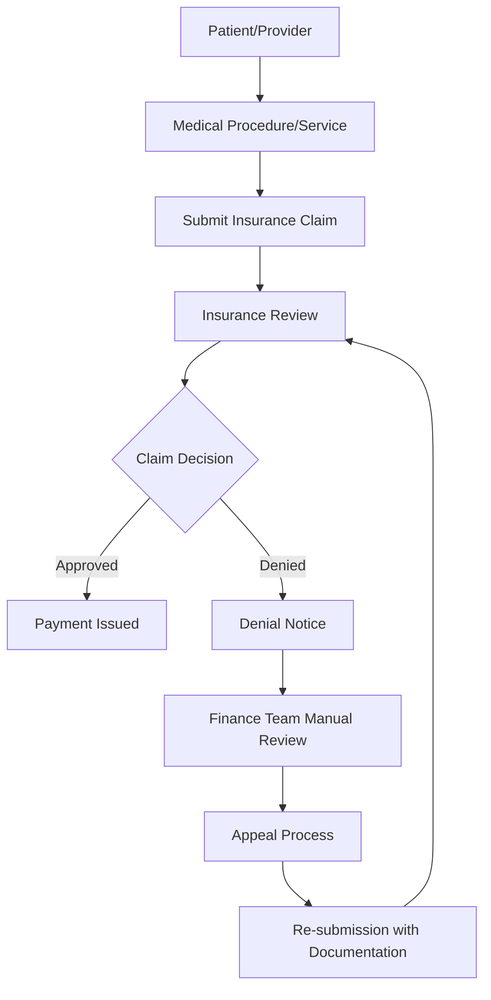
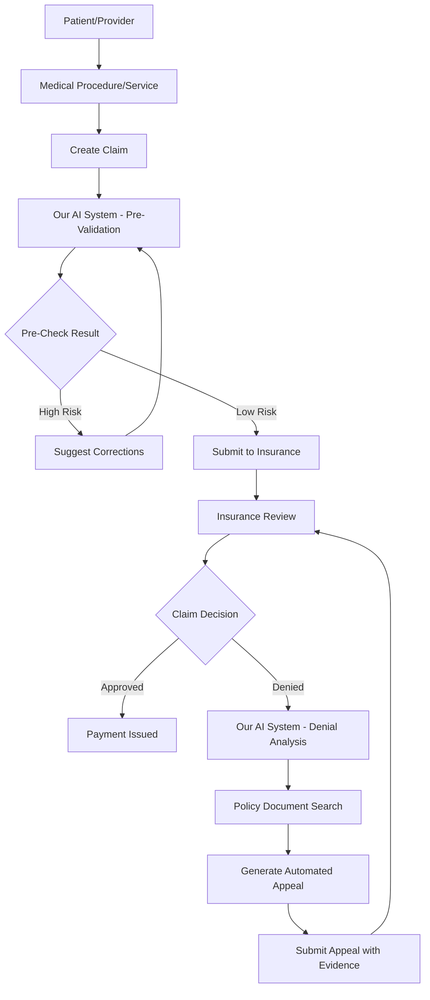

# TechUp 2025 - The BattleBots - Snowflake Cortex Claims Optimization System

**Team Lead:** Nick Akincilar  
**Team Members:** Brendan Schultz, Fady Heiba, Jack Roche, Michael Costner, Nick Akincilar

## Project Overview

A **Snowflake Cortex-powered** intelligent orchestration system built for healthcare finance teams and insurance providers to optimize claims processing and reduce claim denials. This demo showcases the full power of Snowflake's AI capabilities including Cortex Complete, Cortex Search, Cortex Analyst, and AI Extract in a real-world healthcare use case - perfect for sales engineers demonstrating Snowflake's AI platform.

**Vision:** Create a one-stop shop for any sort of insurance claim optimization - applicable to healthcare, auto, homeowners, and other insurance types.

## The Insurance Claims Challenge

### Current Insurance Flow (What We Learned)



### Key Problems Identified
1. **High Denial Rates**: Claims often denied due to incorrect coding, missing documentation, or misinterpretation of policy rules
2. **Manual Appeals Process**: Finance teams spend significant time manually reviewing denials and crafting appeals
3. **Complex Policy Matching**: Difficulty matching claim details against complex insurance policy documents
4. **Revenue Loss**: Denied claims represent lost revenue that requires time-intensive recovery processes

## Our Solution: Intelligent Claims Optimization

### What Our Project Does in the Flow

Our system intercepts and enhances the claims process at multiple points:

1. **Pre-Submission Validation**: Analyze claims before submission to predict approval likelihood
2. **Denial Analysis**: Automatically process denial notices to identify root causes
3. **Policy Matching**: Use AI to match claim details against insurance policy documents
4. **Automated Appeals**: Generate appeals with supporting documentation and policy references

### Enhanced Flow with Our System



## Technical Architecture

### Snowflake-Native Architecture

This solution is built entirely within the Snowflake ecosystem, leveraging the full power of Snowflake Cortex AI capabilities. All data processing, AI inference, and business logic runs natively in Snowflake, providing enterprise-scale performance and security.

### Core Components

#### 1. **Claims Data Processing**
- **Input**: Structured claim data (XML/JSON format)
- **Content**: Procedure codes, costs, patient information, provider details
- **Processing**: Validation, normalization, code verification

#### 2. **Policy Document Analysis**
- **Snowflake AI Extract**: Process unstructured insurance policy documents using Snowflake's native AI capabilities
- **Cortex Search**: Fuzzy matching of procedures against policy rules with vector-based semantic search
- **Cortex Complete**: LLM-powered analysis and rule extraction from policy documents
- **Rule Database**: Structured lookup table for procedure codes and approval criteria stored in Snowflake

#### 3. **AI-Powered Matching Engine**
- **Code Validation**: Verify correct procedure codes against insurance databases
- **Fuzzy Matching**: Find similar procedures when exact codes don't match
- **Policy Compliance Check**: Match claim details against policy requirements

#### 4. **Automated Response Generation**
- **Appeal Generation**: Create structured appeals with policy references
- **Supporting Documentation**: Compile relevant policy excerpts and justifications
- **Multi-format Output**: Email templates, PDF reports, structured data exports

### Technology Stack

- **Frontend**: Streamlit web application with potential for full React frontend
- **Backend**: Python-based processing engine
- **AI/ML**: 
  - **Snowflake Cortex Complete**: LLM capabilities for natural language processing and response generation
  - **Snowflake Cortex Search**: Vector-based semantic search for policy matching
  - **Snowflake AI Extract**: Native unstructured document processing and data extraction
  - **Snowflake Cortex Analyst**: Advanced analytics and pattern recognition
- **Data Platform**: Snowflake as the single source of truth for all data and processing
- **Document Storage**: Snowflake stages for secure PDF/document storage and processing
- **Compute**: Snowflake warehouses for scalable processing power
- **Security**: Snowflake's enterprise-grade security and governance

### Snowflake Cortex Showcase Features

This demo highlights key Snowflake Cortex capabilities that sales engineers can showcase:

#### **Cortex Complete (LLM)**
- **Intelligent Appeal Generation**: Generate personalized appeal letters using context from policy documents
- **Claims Analysis**: Natural language analysis of claim details and denial reasons
- **Policy Interpretation**: Convert complex insurance language into actionable insights
- **Multi-model Support**: Leverage different LLM models optimized for specific tasks

#### **Cortex Search (Vector Search)**
- **Semantic Policy Matching**: Find relevant policy sections using natural language queries
- **Procedure Code Similarity**: Match procedures to similar covered services
- **Historical Pattern Recognition**: Identify successful appeal strategies from past cases
- **Real-time Recommendations**: Instant suggestions based on vector similarity

#### **Cortex Analyst (Advanced Analytics)**
- **Denial Pattern Analysis**: Identify trends and patterns in claim denials
- **Success Rate Optimization**: Analyze which strategies lead to successful appeals
- **Cost-Benefit Modeling**: Predict ROI of different appeal approaches
- **Provider Performance Insights**: Analytics on provider-specific denial rates

#### **AI Extract (Document Processing)**
- **Unstructured Data Processing**: Extract structured data from PDF denial notices and policy documents
- **Multi-format Support**: Process various document types within Snowflake
- **Automated Classification**: Categorize documents and extract key entities
- **Native Integration**: No external APIs required - everything runs in Snowflake

### Enterprise Benefits for Sales Demo
- **Single Platform**: All AI capabilities within Snowflake ecosystem - no external dependencies
- **Governance & Security**: Enterprise-grade data protection and compliance built-in
- **Scalability**: Auto-scaling compute resources based on demand
- **Cost Optimization**: Pay-per-use model for AI services with transparent pricing
- **Integration**: Seamless connection with existing Snowflake data and workflows

## Data Requirements

### Primary Data Sources

1. **Claims Data**
   - Patient/provider information
   - Procedure codes and descriptions
   - Cost information
   - Claim submission details

2. **Insurance Policy Documents**
   - Coverage rules and limitations
   - Procedure approval criteria
   - Code-specific requirements
   - Exclusions and exceptions

3. **Procedure Code Database**
   - Standard medical/service codes
   - Code descriptions and categories
   - Insurance-specific code mappings

4. **Denial History**
   - Previous denial notices
   - Appeal outcomes
   - Pattern analysis data

### Sample Data Generation Strategy
- Use Snowflake Cortex Complete to generate realistic claim scenarios
- Create mock insurance policy documents stored in Snowflake stages
- Generate PDF denial notices for Snowflake AI Extract processing
- Build synthetic procedure code databases using Snowflake's data generation capabilities

## Development Roadmap

### Phase 1: Foundation (Current)
- [x] Project setup and team formation
- [x] Requirements analysis and flow mapping
- [ ] Data schema design
- [ ] Core data generation scripts

### Phase 2: Core Engine
- [ ] Claims validation engine using Snowflake stored procedures
- [ ] Policy document processing with Snowflake AI Extract
- [ ] Vector-based matching algorithms with Cortex Search
- [ ] Cortex Search integration with semantic similarity

### Phase 3: AI Integration
- [ ] Cortex Complete-powered policy analysis and interpretation
- [ ] Automated appeal generation using Cortex Complete
- [ ] Semantic similarity matching with Cortex Search vectors
- [ ] Response optimization using Snowflake ML functions

### Phase 4: User Interface
- [ ] Streamlit application development
- [ ] Dashboard for claim analysis
- [ ] Appeal generation interface
- [ ] Results visualization

### Phase 5: Advanced Features
- [ ] Multi-insurance provider support
- [ ] Batch processing capabilities
- [ ] Analytics and reporting
- [ ] Integration APIs

## Hackathon Demo Features

This project is specifically designed for **Snowflake sales engineers** to showcase Snowflake Cortex capabilities in a real-world healthcare scenario.

### Key Demo Talking Points

#### **Snowflake as a Complete AI Platform**
- **All-in-One Solution**: No external AI services needed - everything runs natively in Snowflake
- **Enterprise Ready**: Built-in security, governance, and compliance for healthcare data
- **Cost Effective**: No data movement costs, transparent AI service pricing

#### **Technical Differentiators**
- **Vector Search**: Demonstrate semantic similarity for policy matching
- **LLM Integration**: Show how Cortex Complete generates human-like responses
- **Document Processing**: Live demo of AI Extract processing PDF documents
- **Scalable Compute**: Highlight auto-scaling warehouse capabilities

#### **Business Value Propositions**
- **Faster Time to Value**: Pre-built solution reduces development time
- **Reduced IT Complexity**: Single platform eliminates integration challenges
- **Improved ROI**: Automated appeals increase revenue recovery rates
- **Compliance Ready**: Healthcare data remains secure within Snowflake

### Live Demo Capabilities
1. **Upload Claim Document**: Real-time AI Extract processing
2. **Policy Matching**: Vector search finds relevant policy sections instantly  
3. **Appeal Generation**: Watch Cortex Complete create personalized appeals
4. **Success Analytics**: Show Cortex Analyst insights on denial patterns

## Demo Scenario

### Final Demo Flow
1. **Upload Claim**: User submits insurance claim through web interface
2. **Select Insurance Provider**: Choose from dropdown of supported insurers
3. **AI Analysis**: System analyzes claim against policy documents
4. **Risk Assessment**: Display approval probability and identified issues
5. **Recommendations**: Show suggested corrections or additional documentation
6. **Appeal Generation**: If needed, generate automated appeal with policy references
7. **Results Display**: Highlight relevant policy sections and justification

### Success Metrics
- Reduction in claim denial rates
- Decreased time to appeal resolution
- Increased revenue recovery
- Improved finance team efficiency

## Business Applications

### Primary Use Cases
1. **Healthcare Providers**: Optimize medical claim submissions
2. **Auto Repair Shops**: Improve insurance claim success rates
3. **Healthcare Finance Teams**: Streamline denial management
4. **Insurance Companies**: Reduce processing overhead and improve customer experience

### Expandability
- **Multi-Industry**: Adaptable to any insurance claim type
- **Customizable Rules**: Upload custom policy documents
- **Scalable Processing**: Handle individual claims or batch processing
- **White-Label Solution**: Embeddable in existing insurance portals

## Getting Started

### Prerequisites
- Python 3.8+
- **Snowflake account with Cortex enabled** (Complete, Search, and Analyst)
- **Snowflake AI Extract** functionality enabled
- Streamlit for web interface
- Snowflake Connector for Python

### Installation
```bash
# Clone the repository
git clone [repository-url]
cd techup-25-healthcare-claims-denial

# Install dependencies
pip install -r requirements.txt

# Set up environment variables for Snowflake
cp .env.example .env
# Edit .env with your Snowflake connection details:
# SNOWFLAKE_ACCOUNT, SNOWFLAKE_USER, SNOWFLAKE_PASSWORD
# SNOWFLAKE_DATABASE, SNOWFLAKE_SCHEMA, SNOWFLAKE_WAREHOUSE

# Run the application
streamlit run app.py
```

### Configuration
- **Snowflake connection parameters** (account, user, password, database, schema)
- **Cortex services configuration** (Complete, Search, Analyst models)
- **AI Extract settings** for document processing
- **Snowflake stages** for document and data storage
- Insurance provider data sources integrated through Snowflake connectors

---

*This project aims to transform the insurance claims process from a reactive, manual workflow into a proactive, AI-driven optimization system that benefits providers, patients, and insurance companies alike.*
