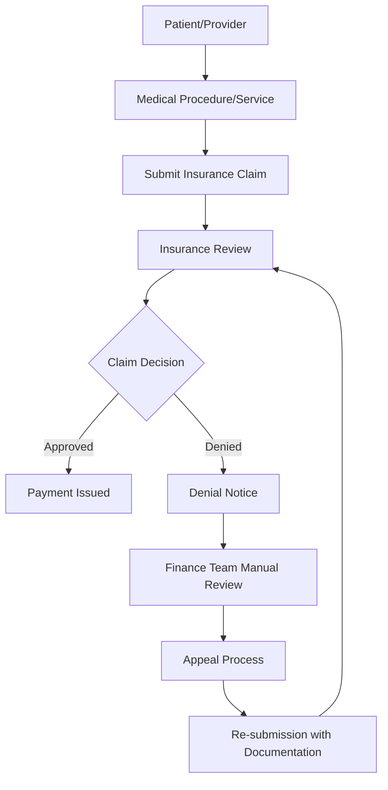
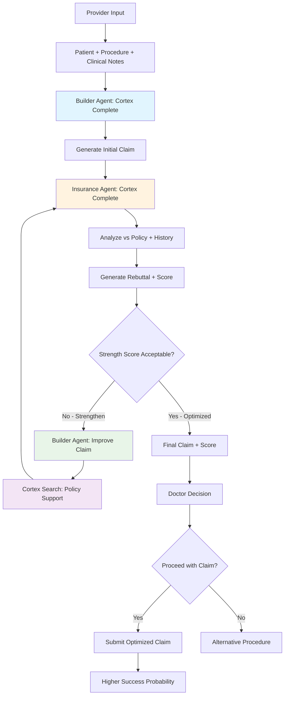

# TechUp 2025 - The BattleBots - Snowflake Cortex Claims Optimization System

**Team Lead:** Nick Akincilar  
**Team Members:** Brendan Schultz, Fady Heiba, Jack Roche, Michael Costner, Nick Akincilar

## Project Overview

A **Snowflake Cortex-powered** intelligent orchestration system built for healthcare finance teams and insurance providers to optimize claims processing and reduce claim denials. This demo showcases the full power of Snowflake's AI capabilities including Cortex Complete, Cortex Search, Cortex Analyst, and AI Extract, while leveraging **real healthcare data from the Snowflake Marketplace** - perfect for sales engineers demonstrating Snowflake's complete data platform.

**Vision:** Create a one-stop shop for any sort of insurance claim optimization - applicable to healthcare, auto, homeowners, and other insurance types.

## 🏬 **Snowflake Marketplace Integration**

This demo leverages **real healthcare claims data** from the Snowflake Marketplace, specifically the `CLAIMS_HOSPITAL_CLAIMS__REMITS_DATA` database, showcasing how organizations can instantly access and analyze third-party datasets without complex data pipelines or lengthy procurement processes.

**Key Marketplace Benefits Demonstrated:**
- **Instant Data Access**: No ETL required - data is immediately queryable
- **Real Healthcare Data**: Authentic claims and remittance datasets for realistic demos
- **Zero Data Movement**: Data stays secure within Snowflake ecosystem
- **Live Updates**: Marketplace data refreshes automatically from providers

## The Insurance Claims Challenge

### Current Insurance Flow (What We Learned)



### Key Problems Identified
1. **High Denial Rates**: Claims often denied due to incorrect coding, missing documentation, or misinterpretation of policy rules
2. **Manual Appeals Process**: Finance teams spend significant time manually reviewing denials and crafting appeals
3. **Complex Policy Matching**: Difficulty matching claim details against complex insurance policy documents
4. **Revenue Loss**: Denied claims represent lost revenue that requires time-intensive recovery processes

## Our Solution: AI-Powered Dual-Agent Claims Optimization

### 💡 **Revolutionary Approach: Adversarial AI Architecture**

Unlike traditional claims systems that only validate after submission, our solution uses **two competing AI agents** to iteratively optimize claims **before** submission:

- **🛠️ Builder Agent**: Optimizes claims for maximum approval probability
- **🛡️ Insurance Agent**: Challenges claims using realistic insurance company logic  
- **🔄 Optimization Loop**: Agents iterate until optimal balance of accuracy and approval likelihood
- **📊 Confidence Scoring**: Quantifies claim strength for informed decision-making

This **game-theory inspired approach** mirrors real-world insurance dynamics while leveraging Snowflake's complete AI platform.

### What Our Project Does in the Flow

Our system **revolutionizes the claims-generation process** with an AI-driven approach that saves providers time and dramatically increases claim approval probability through iterative optimization:

#### **🤖 Dual AI Agent Architecture**

**1. Provider Input & Initial Setup**
- Provider selects patient, procedure, and inputs clinical notes
- System gathers patient data from `CLAIMS_DEMO` database
- Retrieves relevant insurance policy information

**2. Builder Agent (Claims Optimization)**
- Gathers doctor inputs, patient data, and insurance policy information 
- Uses **Snowflake Cortex Complete** to generate optimized insurance claim
- Leverages marketplace data patterns from `CLAIMS_HOSPITAL_CLAIMS__REMITS_DATA`

**3. Insurance Agent (Claims Validation)**  
- Acts as adversarial validator using **Cortex Complete**
- Analyzes claim against insurance policy and claims history
- Outputs detailed "rebuttal" with specific weaknesses and strength score
- **Goal**: Deny claims while staying within policy framework (realistic insurance behavior)

**4. Iterative Optimization Loop**
- Builder receives rebuttal feedback and strengthens claim
- Uses **Cortex Search** to find supporting policy language and precedents
- Cycle repeats until optimal claim strength achieved

**5. Final Decision Support**
- Outputs final claim with associated strength score to doctor
- Doctor reviews AI-optimized claim and decides whether to proceed
- System provides confidence metrics and risk assessment

### Enhanced Flow with Our Dual-Agent System



## Technical Architecture

### Snowflake-Native Architecture

This solution is built entirely within the Snowflake ecosystem, leveraging the full power of Snowflake Cortex AI capabilities. All data processing, AI inference, and business logic runs natively in Snowflake, providing enterprise-scale performance and security.

### Core Components

#### 1. **Provider Interface & Data Ingestion**
- **Input Collection**: Patient selection, procedure codes, clinical notes
- **Data Integration**: Patient history from `CLAIMS_DEMO`, insurance policies, marketplace patterns
- **Processing**: Validation, normalization, code verification against `CLAIMS_HOSPITAL_CLAIMS__REMITS_DATA`

#### 2. **Builder Agent (Claims Optimization)**
- **Cortex Complete Integration**: LLM-powered claim generation and optimization
- **Marketplace Intelligence**: Leverages real claims patterns from marketplace data
- **Policy Analysis**: Uses Cortex Search for relevant policy language and precedents
- **Iterative Improvement**: Incorporates feedback to strengthen claims through multiple iterations

#### 3. **Insurance Agent (Adversarial Validation)**
- **Cortex Complete Analysis**: Acts as realistic insurance reviewer
- **Policy Enforcement**: Strict adherence to insurance company guidelines and precedent
- **Rebuttal Generation**: Provides detailed feedback on claim weaknesses
- **Scoring System**: Quantitative strength assessment for claims

#### 4. **Optimization Loop Engine**
- **Feedback Integration**: Builder agent processes insurance agent rebuttals
- **Cortex Search**: Finds supporting evidence and policy justifications
- **Iterative Refinement**: Continuous improvement until optimal strength achieved
- **Decision Support**: Final claims with confidence metrics and risk assessment

### Technology Stack

- **Frontend**: Streamlit web application with potential for full React frontend
- **Backend**: Python-based processing engine
- **AI/ML**: 
  - **Snowflake Cortex Complete**: LLM capabilities for natural language processing and response generation
  - **Snowflake Cortex Search**: Vector-based semantic search for policy matching
  - **Snowflake AI Extract**: Native unstructured document processing and data extraction
  - **Snowflake Cortex Analyst**: Advanced analytics and pattern recognition
- **Data Platform**: Snowflake as the single source of truth combining marketplace data (`CLAIMS_HOSPITAL_CLAIMS__REMITS_DATA`) with custom processing (`CLAIMS_DEMO`)
- **Document Storage**: Snowflake stages in `CLAIMS_DEMO` database for secure PDF/document storage and processing
- **Compute**: Snowflake warehouses for scalable processing power across multiple data sources
- **Security**: Snowflake's enterprise-grade security and governance protecting both marketplace and custom data

### Snowflake Cortex Showcase Features

This demo highlights key Snowflake Cortex capabilities that sales engineers can showcase:

#### **Cortex Complete (LLM) - Dual Agent System**
- **Builder Agent**: Generate and iteratively optimize insurance claims using policy context
- **Insurance Agent**: Adversarial validation and rebuttal generation simulating real insurance behavior
- **Policy Interpretation**: Convert complex insurance language into actionable insights for both agents
- **Multi-model Support**: Leverage different LLM models optimized for claim building vs. claim validation tasks

#### **Cortex Search (Vector Search)**
- **Semantic Policy Matching**: Find relevant policy sections using natural language queries
- **Procedure Code Similarity**: Match procedures to similar covered services
- **Historical Pattern Recognition**: Identify successful appeal strategies from past cases
- **Real-time Recommendations**: Instant suggestions based on vector similarity

#### **Cortex Analyst (Advanced Analytics)**
- **Denial Pattern Analysis**: Identify trends and patterns in claim denials
- **Success Rate Optimization**: Analyze which strategies lead to successful appeals
- **Cost-Benefit Modeling**: Predict ROI of different appeal approaches
- **Provider Performance Insights**: Analytics on provider-specific denial rates

#### **AI Extract (Document Processing)**
- **Unstructured Data Processing**: Extract structured data from PDF denial notices and policy documents
- **Multi-format Support**: Process various document types within Snowflake
- **Automated Classification**: Categorize documents and extract key entities
- **Native Integration**: No external APIs required - everything runs in Snowflake

#### **Marketplace Integration (Data Access)**
- **Real Healthcare Data**: Instant access to `CLAIMS_HOSPITAL_CLAIMS__REMITS_DATA` marketplace dataset
- **No ETL Required**: Direct queries against live marketplace data
- **Third-party Data Discovery**: Browse and access external datasets instantly
- **Secure Data Sharing**: All data stays within Snowflake's secure ecosystem

### Enterprise Benefits for Sales Demo
- **Single Platform**: All AI capabilities within Snowflake ecosystem - no external dependencies
- **Marketplace Advantage**: Instant access to third-party data without complex integrations
- **Governance & Security**: Enterprise-grade data protection and compliance built-in
- **Scalability**: Auto-scaling compute resources based on demand
- **Cost Optimization**: Pay-per-use model for AI services with transparent pricing
- **Zero Data Movement**: Marketplace data and processing stay within Snowflake

## Data Architecture & Sources

### Snowflake Database Structure

#### **Production Marketplace Data**
- **Database**: `CLAIMS_HOSPITAL_CLAIMS__REMITS_DATA` (Snowflake Marketplace)
- **Schema**: `ISTG` (Main data schema)
- **Purpose**: Real healthcare claims and remittance data for authentic analysis
- **Benefits**: Live, updated healthcare data without ETL complexity
- **Key Tables**: 8 tables with 13+ million rows of healthcare transaction data

#### **Demo Project Database** 
- **Database**: `CLAIMS_DEMO` (Main project workspace)
- **Schema**: `PUBLIC` (Standard schema)
- **Purpose**: Custom tables, processed results, demo-specific data
- **Integration**: Combines marketplace data with custom processing logic

### Primary Data Sources

1. **Marketplace Claims Data** 🏪
   - **Source**: Snowflake Marketplace (`CLAIMS_HOSPITAL_CLAIMS__REMITS_DATA.ISTG`)
   - **Key Tables for Dual-Agent System**:
   
   #### **CLAIMCHARGEDETAIL** (25,350 rows) - Claims Submissions 
   - **Role in Workflow**: Input for Builder Agent
   - **Key Columns**: `CLAIMID`, `CHARGEPROCEDURECODE`, `CHARGES`, `PLACEOFSERVICECODE`, `MODIFIER1-4`
   - **Usage**: Real claim structure patterns for Builder Agent to emulate
   
   #### **EOBDETAIL** (3.6M rows) - Insurance Responses & Denials ⚠️ 
   - **Role in Workflow**: Training data for Insurance Agent
   - **Key Columns**: `CLAIMID`, `EOBPAYERNAME`, `BILLEDAMOUNT`, `PAIDAMOUNT`, `DENIEDADJUSTMENT`, `DENIALCATEGORYID`
   - **Usage**: Realistic denial patterns, adjustment logic, and payer behavior for adversarial validation
   - **Denial Examples**: Various payers with denial amounts up to $2.2M, focused on Cigna policy scenarios
   
   #### **CPTDETAIL** (5.4M rows) - Procedure Codes
   - **Role in Workflow**: Validation for both agents  
   - **Key Columns**: `CLAIMID`, `CPTCODE`, `SEQUENCE`
   - **Usage**: Real procedure code combinations and sequencing patterns
   
   #### **DIAGNOSISDETAIL** (2M rows) - Diagnosis Codes
   - **Role in Workflow**: Supporting evidence for both agents
   - **Key Columns**: `CLAIMID`, `DIAGCODE`, `SEQUENCE` 
   - **Usage**: ICD-10 diagnosis patterns for procedure justification
   
   #### **FACILITYDETAIL** (950k rows) - Provider Information
   - **Role in Workflow**: Context for claim evaluation
   - **Usage**: Provider-specific denial patterns and credentialing context

2. **Project Database Tables & Views** (Built in `CLAIMS_DEMO.PUBLIC`)

   #### **Patient & Provider Data**
   - **PATIENTS** (Table): Patient demographics, Cigna insurance details, medical history
     - **Role**: Builder Agent gathers patient context for claim generation
     - **Usage**: Medical history, allergies, current medications inform claim details
   
   - **COMMON_PROCEDURES** (Table): Frequent procedures with Cigna coverage details
     - **Role**: Builder Agent reference for appropriate procedure selection
     - **Usage**: Coverage notes, cost ranges, common diagnoses for context

   #### **Procedure Code Intelligence**  
   - **PROCEDURE_CODES_REFERENCE** (View): CPT codes with marketplace usage frequency
     - **Role**: Both agents validate procedure codes against real-world usage
     - **Usage**: High-usage codes (85025, 80053, 36415) indicate safer claim choices
   
   - **PROCEDURE_CODES_WITH_DESCRIPTIONS** (View): Enhanced codes with marketplace data
     - **Role**: Builder Agent optimizes procedure selection using usage patterns
     - **Usage**: Combines detailed descriptions with real-world success data

   #### **Insurance Agent Toolkit**
   - **DENIAL_PATTERNS** (View): Real marketplace denial analysis by payer type  
     - **Role**: Insurance Agent references actual denial behavior patterns
     - **Usage**: Authentic denial logic based on Medicare, Blue Cross, Optum precedents
   
   - **DENIAL_REASONS** (Table): Cigna-specific denial categories with rebuttal templates
     - **Role**: Insurance Agent generates realistic rebuttals using actual policy language
     - **Usage**: Prior auth, medical necessity, coding issues, frequency limits
   
   - **INSURANCE_AGENT_TOOLKIT** (View): Complete rebuttal resource with precedent data
     - **Role**: Insurance Agent delivers consistent, policy-backed rebuttals
     - **Usage**: Templates + marketplace precedent strength for authentic responses

   #### **Builder Agent Optimization**
   - **SUCCESSFUL_CLAIMS_PATTERNS** (View): Approved claims with full payment details
     - **Role**: Builder Agent learns from actually successful claim structures  
     - **Usage**: Payment rates, payer preferences, successful claim formatting
   
   - **BUILDER_AGENT_SUCCESS_GUIDE** (View): Success metrics by procedure code
     - **Role**: Builder Agent optimizes procedure selection for higher approval probability
     - **Usage**: Success confidence scoring and payer-specific success patterns

   #### **Policy Knowledge Base**
   - **CIGNA_POLICY_RULES** (Table): Comprehensive Cigna coverage policies
     - **Role**: Both agents reference official policy for claims generation and validation
     - **Usage**: Prior auth requirements, frequency limits, coverage criteria
   
   - **AGENT_POLICY_LOOKUP** (View): Unified policy reference combining rules and coverage notes
     - **Role**: Single source of truth for both agents on Cigna policy compliance
     - **Usage**: Real-time policy validation during claim generation and rebuttal processes

   #### **Strength Assessment**
   - **CLAIM_STRENGTH_CALCULATOR** (View): Overall marketplace approval/denial statistics
     - **Role**: Insurance Agent calculates realistic claim strength scores
     - **Usage**: 8.6% baseline approval rate, 79.7% average denial percentage for scoring

### Data Strategy: Real Marketplace + AI-Generated Scenarios

#### **Marketplace Data Powers Cortex Agent Queries** 🤖
- **Builder Agent Data**: Query successful claim patterns from `CLAIMCHARGEDETAIL` via Cortex Analyst
- **Insurance Agent Data**: Access real payer denial logic from `EOBDETAIL` via Cortex Analyst
- **Procedure Validation**: Cross-reference codes using `CPTDETAIL` and `DIAGNOSISDETAIL` queries
- **Denial Categories**: 6 distinct denial categories with 47 total denial cases for agent context

#### **AI-Generated Content for Scenarios**
- **Policy Documents**: Use Cortex Complete to generate realistic insurance policies
- **Denial Scenarios**: Create variations based on marketplace denial patterns
- **Appeal Strategies**: Build success case libraries using historical EOB data
- **Optimization Rules**: Extract patterns from $184K-$2.2M denial cases

#### **Cortex Agent API Flow**
1. **Builder Agent** queries marketplace data via Cortex Analyst for successful claim patterns
2. **Insurance Agent** queries denial data via Cortex Analyst to simulate payer behavior
3. **Optimization Loop** orchestrated by frontend making sequential API calls to both agents
4. **Success Scoring** calculated by agents using real payer approval/denial ratios from marketplace data

## Development Roadmap - Dual-Agent Architecture

### Phase 1: Data Foundation & Setup ✅
- [x] Project setup and dual-agent architecture design
- [x] Marketplace data analysis (13M+ rows)
- [x] Database access configuration (CLAIMS_HOSPITAL_CLAIMS__REMITS_DATA + CLAIMS_DEMO)
- [x] Identified key datasets for Cortex Agent configuration

### Phase 2: Data Views for Agent Workflows 📊
**Goal**: Structure data for the claim generation → rebuttal → optimization loop
- [x] **Patient Data Views**: Create tables/views for patient information lookup by Builder Agent
- [x] **Procedure Code Reference**: Setup `CPTDETAIL`/`DIAGNOSISDETAIL` for Builder Agent claim generation
- [x] **Claims History Views**: Structure `EOBDETAIL` for Insurance Agent rebuttal analysis
- [x] **Successful Claims Patterns**: Views on `CLAIMCHARGEDETAIL` for Builder Agent optimization
- [x] **Insurance Policy Tables**: Prepare policy data structure for both agents

### Phase 3: Builder Agent Development 🛠️
**Goal**: Create claim generator that gathers inputs and outputs insurance claims
- [ ] **Builder Agent Setup**: Configure Cortex Agent to generate insurance claims from provider inputs
- [ ] **Data Integration**: Connect to patient data, procedure codes, and insurance policies via Cortex Analyst
- [ ] **Claim Generation Logic**: Prompt engineering for creating properly formatted insurance claims
- [ ] **Feedback Processing**: Configure agent to receive rebuttal feedback and strengthen claims
- [ ] **API Endpoint**: Expose Builder Agent functionality for frontend calls

### Phase 4: Insurance Agent Development 🛡️
**Goal**: Create adversarial validator that analyzes claims and outputs rebuttals with strength scores
- [ ] **Insurance Agent Setup**: Configure Cortex Agent to analyze claims and generate rebuttals
- [ ] **Denial Logic Integration**: Connect to `EOBDETAIL` denial patterns and policy data via Cortex Analyst
- [ ] **Strength Scoring System**: Implement claim strength assessment based on denial likelihood
- [ ] **Rebuttal Generation**: Prompt engineering for detailed feedback on claim weaknesses
- [ ] **API Endpoint**: Expose Insurance Agent functionality for receiving claims and returning rebuttals

### Phase 5: Policy Knowledge Base 📋
**Goal**: Create searchable insurance policy data for both agents
- [ ] **Policy Document Generation**: Use Cortex Complete to create realistic insurance policies
- [ ] **AI Extract Pipeline**: Process PDFs → structured policy data in Snowflake tables
- [ ] **Cortex Search Setup**: Configure vector search over policy documents for both agents
- [ ] **Policy Integration**: Enable Builder Agent to gather policy info, Insurance Agent to enforce policies

### Phase 6: Dual-Agent Orchestration Loop 🔄
**Goal**: Implement the iterative claim optimization workflow
- [ ] **Workflow Engine**: Build logic to orchestrate Provider Input → Builder → Insurance → Builder loop
- [ ] **API Integration**: Sequential calls to Builder Agent (generate) → Insurance Agent (rebuttal) → Builder Agent (optimize)
- [ ] **Convergence Logic**: Determine when claim is optimally strengthened (strength score threshold)
- [ ] **Final Output**: Return optimized claim + strength score to provider for decision

### Phase 7: Frontend Development 🎯
**Goal**: Streamlit interface for the complete provider workflow
- [ ] **Provider Input UI**: Interface for selecting patient, procedure, and inputting clinical notes
- [ ] **Dual-Agent Visualization**: Real-time display of Builder → Insurance → Builder iterations
- [ ] **Claims Display**: Show claim generation, rebuttals, and optimizations in progress
- [ ] **Final Results**: Present optimized claim + strength score for provider decision
- [ ] **Decision Interface**: Allow provider to accept optimized claim or explore alternatives

### Phase 8: Demo Scenarios & Polish 📊
**Goal**: Sales-ready demonstration scenarios
- [ ] **Pre-built Patient Scenarios**: Create consistent demo cases (patient + procedure combinations)
- [ ] **Marketplace Data Integration**: Show real healthcare data powering agent decisions
- [ ] **Live Demo Flow**: Complete provider workflow from input to final claim decision
- [ ] **Sales Talking Points**: Documentation highlighting Snowflake Cortex capabilities

## Hackathon Demo Features

This project is specifically designed for **Snowflake sales engineers** to showcase Snowflake Cortex capabilities in a real-world healthcare scenario.

### Key Demo Talking Points

#### **Snowflake as a Complete Data & AI Platform**
- **All-in-One Solution**: No external AI services needed - everything runs natively in Snowflake
- **Marketplace Integration**: Instant access to third-party healthcare data without ETL
- **Enterprise Ready**: Built-in security, governance, and compliance for healthcare data
- **Cost Effective**: No data movement costs, transparent AI service pricing

#### **Technical Differentiators**
- **Marketplace Data Access**: Live queries against real healthcare claims data
- **Vector Search**: Demonstrate semantic similarity for policy matching
- **LLM Integration**: Show how Cortex Complete generates human-like responses
- **Document Processing**: Live demo of AI Extract processing PDF documents
- **Scalable Compute**: Highlight auto-scaling warehouse capabilities

#### **Business Value Propositions**
- **Faster Time to Value**: Pre-built solution reduces development time
- **Reduced IT Complexity**: Single platform eliminates integration challenges
- **Improved ROI**: Automated appeals increase revenue recovery rates
- **Compliance Ready**: Healthcare data remains secure within Snowflake

### Live Demo Capabilities
1. **Provider Input Simulation**: Select patient, procedure, and input clinical notes
2. **Builder Agent in Action**: Watch Cortex Complete generate initial optimized claim
3. **Insurance Agent Challenge**: See adversarial validation and rebuttal generation
4. **Iterative Optimization**: Observe the Builder-Insurance agent feedback loop
5. **Marketplace Intelligence**: Real-time queries against `CLAIMS_HOSPITAL_CLAIMS__REMITS_DATA` for precedent analysis
6. **Policy Vector Search**: Cortex Search finds supporting policy language instantly
7. **Final Decision Support**: Present claim strength score and confidence metrics to provider

## Demo Scenario

### Final Demo Flow
1. **Provider Setup**: Doctor selects patient, procedure (e.g., MRI), and inputs clinical notes
2. **Builder Agent Initialization**: Cortex Complete gathers data and generates initial claim
3. **Insurance Agent Analysis**: Adversarial agent analyzes claim, provides detailed rebuttal and strength score
4. **Optimization Loop Demo**: Watch Builder agent improve claim based on feedback (2-3 iterations)
5. **Marketplace Validation**: Show how system uses `CLAIMS_HOSPITAL_CLAIMS__REMITS_DATA` for precedent support
6. **Policy Search**: Demonstrate Cortex Search finding supporting policy language
7. **Final Recommendation**: Present optimized claim with strength score to doctor
8. **Decision Point**: Doctor chooses to proceed with optimized claim or consider alternatives
9. **Success Metrics**: Display improved approval probability vs. original claim

### Success Metrics for Dual-Agent System
- **Pre-submission optimization**: Higher approval rates through proactive claim strengthening
- **Reduced denial rates**: AI agents identify and fix issues before submission
- **Faster decision-making**: Confidence scores help providers make informed choices
- **Revenue optimization**: Focus resources on high-probability claims
- **Provider efficiency**: Automated optimization reduces manual claim review time
- **Learning system**: Marketplace data improves agent performance over time

## Business Applications

### Primary Use Cases
1. **Healthcare Providers**: Optimize medical claim submissions
2. **Auto Repair Shops**: Improve insurance claim success rates
3. **Healthcare Finance Teams**: Streamline denial management
4. **Insurance Companies**: Reduce processing overhead and improve customer experience

### Expandability
- **Multi-Industry**: Adaptable to any insurance claim type
- **Customizable Rules**: Upload custom policy documents
- **Scalable Processing**: Handle individual claims or batch processing
- **White-Label Solution**: Embeddable in existing insurance portals

## Getting Started

### Prerequisites
- Python 3.8+
- **Snowflake account**: Access to `sfsenorthamerica-demo158` with Cortex enabled
- **Database Access**: Permissions to `CLAIMS_DEMO` and `CLAIMS_HOSPITAL_CLAIMS__REMITS_DATA` (marketplace)
- **Snowflake CLI**: For secure authentication and database operations
- **RSA Key Pair**: For secure, MFA-free programmatic access
- Streamlit for web interface

### Installation

**📋 Quick Setup (10 minutes):**

```bash
# Clone the repository
git clone [repository-url]
cd techup-25-healthcare-claims-denial

# 1. Setup Snowflake connection
open SETUP.md  # Follow RSA key setup guide

# 2. Run setup notebooks in Snowflake (in order):
# - 01_Data_Views_for_Agent_Workflows.ipynb
# - 02_Builder_Agent_Development.ipynb
```

**⚡ Key Setup Steps:**
1. Generate RSA key pair for secure authentication ([SETUP.md](./SETUP.md))
2. Add public key to your Snowflake user account  
3. Copy `config.toml.template` to `config.toml` and customize
4. **Run setup notebooks in Snowflake** to build data foundation and agents

**📖 Complete instructions: [SETUP.md](./SETUP.md) + Setup Notebooks**

### Configuration
- **Snowflake connection parameters** (account, user, password, warehouse)
- **Database access**: 
  - `CLAIMS_HOSPITAL_CLAIMS__REMITS_DATA` (Marketplace data - read access)
  - `CLAIMS_DEMO` (Main project database - full access)
- **Cortex services configuration** (Complete, Search, Analyst models)
- **AI Extract settings** for document processing in `CLAIMS_DEMO`
- **Snowflake stages** for document storage in project database
- **Marketplace access** for third-party healthcare datasets

## 🚀 **Marketplace Demo Value Proposition**

This demo uniquely showcases **three core Snowflake differentiators** in one cohesive solution:

### **1. Data Cloud Excellence**
- **Instant Data Access**: `CLAIMS_HOSPITAL_CLAIMS__REMITS_DATA` available immediately
- **No Data Pipelines**: Zero ETL, zero data movement, zero integration complexity
- **Live External Data**: Always up-to-date marketplace datasets

### **2. AI Platform Leadership** 
- **Native AI Services**: Cortex Complete, Search, Analyst, and AI Extract
- **No External Dependencies**: Everything runs within Snowflake ecosystem
- **Enterprise AI**: Production-ready with built-in governance and security

### **3. Application Development Platform**
- **End-to-End Solution**: From marketplace data to AI-powered application
- **Streamlit Integration**: Native web app development and deployment
- **Scalable Architecture**: Enterprise-grade performance and reliability

---

**Database Architecture Summary:**
- **`CLAIMS_HOSPITAL_CLAIMS__REMITS_DATA`**: Snowflake Marketplace source data (read-only)
- **`CLAIMS_DEMO`**: Main project database for custom processing and demo results

## 📊 **Current Data Landscape - Ready to Build**

### **✅ Available Data Foundation**

#### **Marketplace Data (Read-Only)**
| **Source** | **Purpose** | **Agent Usage** |
|------------|-------------|-----------------|
| `EOBDETAIL` | Real insurance responses & denial patterns | Insurance Agent references actual payer behavior |
| `CPTDETAIL` | Real procedure code usage patterns | Both agents validate codes against actual usage |
| `DIAGNOSISDETAIL` | Real diagnosis code combinations | Both agents cross-reference diagnosis patterns |
| `CLAIMCHARGEDETAIL` | Successful claim submission structures | Builder Agent learns optimal claim formatting |

#### **Project Database (Fully Built)**
| **Asset** | **Purpose** | **Agent Usage** |
|-----------|-------------|-----------------|
| **PATIENTS** | Patient demographics & Cigna insurance | Builder Agent gathers patient context |
| **COMMON_PROCEDURES** | Frequent procedures with Cigna coverage | Builder Agent selects appropriate procedures |
| **DENIAL_REASONS** | Cigna-specific denial templates | Insurance Agent generates authentic rebuttals |
| **CIGNA_POLICY_RULES** | Official Cigna coverage policies | Both agents ensure policy compliance |
| **Agent Views** | Optimized data access for agent queries | Real-time data lookup during agent operations |

### **🚀 System Ready for Agent Configuration**
- **Builder Agent Data**: Patient info + successful patterns + policy rules + procedure guides
- **Insurance Agent Data**: Denial patterns + rebuttal templates + policy enforcement + strength metrics  
- **Dual-Agent Workflow**: Complete data pipeline from provider input to final claim decision

### **🎯 Data Architecture Complete - Ready for Agents**
1. ✅ **Patient Data**: 5 Cigna members with diverse medical conditions ready for demos
2. ✅ **Procedure Intelligence**: 8 common procedures with Cigna-specific coverage details
3. ✅ **Denial Logic**: 6 realistic denial reasons with authentic Cigna policy templates
4. ✅ **Policy Framework**: Complete Cigna coverage rules for both agent validation
5. ✅ **Success Patterns**: Real marketplace data powering agent optimization logic
6. ✅ **Strength Metrics**: 8.6% baseline approval rate from actual claims data

---

*This project transforms the insurance claims process from a reactive, manual workflow into a proactive, AI-driven optimization system leveraging Snowflake's complete data and AI platform - powered by 13+ million rows of real healthcare data for authentic dual-agent behavior.*
