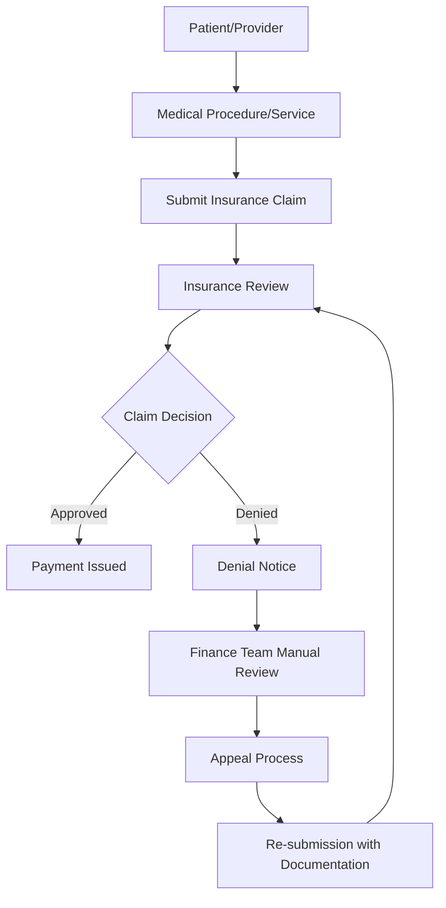
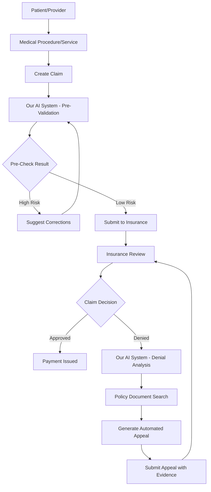

# TechUp 2025 - The BattleBots - Snowflake Cortex Claims Optimization System

**Team Lead:** Nick Akincilar  
**Team Members:** Brendan Schultz, Fady Heiba, Jack Roche, Michael Costner, Nick Akincilar

## Project Overview

A **Snowflake Cortex-powered** intelligent orchestration system built for healthcare finance teams and insurance providers to optimize claims processing and reduce claim denials. This demo showcases the full power of Snowflake's AI capabilities including Cortex Complete, Cortex Search, Cortex Analyst, and AI Extract, while leveraging **real healthcare data from the Snowflake Marketplace** - perfect for sales engineers demonstrating Snowflake's complete data platform.

**Vision:** Create a one-stop shop for any sort of insurance claim optimization - applicable to healthcare, auto, homeowners, and other insurance types.

## 🏬 **Snowflake Marketplace Integration**

This demo leverages **real healthcare claims data** from the Snowflake Marketplace, specifically the `CLAIMS_HOSPITAL_CLAIMS__REMITS_DATA` database, showcasing how organizations can instantly access and analyze third-party datasets without complex data pipelines or lengthy procurement processes.

**Key Marketplace Benefits Demonstrated:**
- **Instant Data Access**: No ETL required - data is immediately queryable
- **Real Healthcare Data**: Authentic claims and remittance datasets for realistic demos
- **Zero Data Movement**: Data stays secure within Snowflake ecosystem
- **Live Updates**: Marketplace data refreshes automatically from providers

## The Insurance Claims Challenge

### Current Insurance Flow (What We Learned)



### Key Problems Identified
1. **High Denial Rates**: Claims often denied due to incorrect coding, missing documentation, or misinterpretation of policy rules
2. **Manual Appeals Process**: Finance teams spend significant time manually reviewing denials and crafting appeals
3. **Complex Policy Matching**: Difficulty matching claim details against complex insurance policy documents
4. **Revenue Loss**: Denied claims represent lost revenue that requires time-intensive recovery processes

## Our Solution: Intelligent Claims Optimization

### What Our Project Does in the Flow

Our system intercepts and enhances the claims process at multiple points:

1. **Pre-Submission Validation**: Analyze claims before submission to predict approval likelihood
2. **Denial Analysis**: Automatically process denial notices to identify root causes
3. **Policy Matching**: Use AI to match claim details against insurance policy documents
4. **Automated Appeals**: Generate appeals with supporting documentation and policy references

### Enhanced Flow with Our System



## Technical Architecture

### Snowflake-Native Architecture

This solution is built entirely within the Snowflake ecosystem, leveraging the full power of Snowflake Cortex AI capabilities. All data processing, AI inference, and business logic runs natively in Snowflake, providing enterprise-scale performance and security.

### Core Components

#### 1. **Claims Data Processing**
- **Input**: Structured claim data (XML/JSON format)
- **Content**: Procedure codes, costs, patient information, provider details
- **Processing**: Validation, normalization, code verification

#### 2. **Policy Document Analysis**
- **Snowflake AI Extract**: Process unstructured insurance policy documents using Snowflake's native AI capabilities
- **Cortex Search**: Fuzzy matching of procedures against policy rules with vector-based semantic search
- **Cortex Complete**: LLM-powered analysis and rule extraction from policy documents
- **Rule Database**: Structured lookup table for procedure codes and approval criteria stored in Snowflake

#### 3. **AI-Powered Matching Engine**
- **Code Validation**: Verify correct procedure codes against insurance databases
- **Fuzzy Matching**: Find similar procedures when exact codes don't match
- **Policy Compliance Check**: Match claim details against policy requirements

#### 4. **Automated Response Generation**
- **Appeal Generation**: Create structured appeals with policy references
- **Supporting Documentation**: Compile relevant policy excerpts and justifications
- **Multi-format Output**: Email templates, PDF reports, structured data exports

### Technology Stack

- **Frontend**: Streamlit web application with potential for full React frontend
- **Backend**: Python-based processing engine
- **AI/ML**: 
  - **Snowflake Cortex Complete**: LLM capabilities for natural language processing and response generation
  - **Snowflake Cortex Search**: Vector-based semantic search for policy matching
  - **Snowflake AI Extract**: Native unstructured document processing and data extraction
  - **Snowflake Cortex Analyst**: Advanced analytics and pattern recognition
- **Data Platform**: Snowflake as the single source of truth combining marketplace data (`CLAIMS_HOSPITAL_CLAIMS__REMITS_DATA`) with custom processing (`CLAIMS_DEMO`)
- **Document Storage**: Snowflake stages in `CLAIMS_DEMO` database for secure PDF/document storage and processing
- **Compute**: Snowflake warehouses for scalable processing power across multiple data sources
- **Security**: Snowflake's enterprise-grade security and governance protecting both marketplace and custom data

### Snowflake Cortex Showcase Features

This demo highlights key Snowflake Cortex capabilities that sales engineers can showcase:

#### **Cortex Complete (LLM)**
- **Intelligent Appeal Generation**: Generate personalized appeal letters using context from policy documents
- **Claims Analysis**: Natural language analysis of claim details and denial reasons
- **Policy Interpretation**: Convert complex insurance language into actionable insights
- **Multi-model Support**: Leverage different LLM models optimized for specific tasks

#### **Cortex Search (Vector Search)**
- **Semantic Policy Matching**: Find relevant policy sections using natural language queries
- **Procedure Code Similarity**: Match procedures to similar covered services
- **Historical Pattern Recognition**: Identify successful appeal strategies from past cases
- **Real-time Recommendations**: Instant suggestions based on vector similarity

#### **Cortex Analyst (Advanced Analytics)**
- **Denial Pattern Analysis**: Identify trends and patterns in claim denials
- **Success Rate Optimization**: Analyze which strategies lead to successful appeals
- **Cost-Benefit Modeling**: Predict ROI of different appeal approaches
- **Provider Performance Insights**: Analytics on provider-specific denial rates

#### **AI Extract (Document Processing)**
- **Unstructured Data Processing**: Extract structured data from PDF denial notices and policy documents
- **Multi-format Support**: Process various document types within Snowflake
- **Automated Classification**: Categorize documents and extract key entities
- **Native Integration**: No external APIs required - everything runs in Snowflake

#### **Marketplace Integration (Data Access)**
- **Real Healthcare Data**: Instant access to `CLAIMS_HOSPITAL_CLAIMS__REMITS_DATA` marketplace dataset
- **No ETL Required**: Direct queries against live marketplace data
- **Third-party Data Discovery**: Browse and access external datasets instantly
- **Secure Data Sharing**: All data stays within Snowflake's secure ecosystem

### Enterprise Benefits for Sales Demo
- **Single Platform**: All AI capabilities within Snowflake ecosystem - no external dependencies
- **Marketplace Advantage**: Instant access to third-party data without complex integrations
- **Governance & Security**: Enterprise-grade data protection and compliance built-in
- **Scalability**: Auto-scaling compute resources based on demand
- **Cost Optimization**: Pay-per-use model for AI services with transparent pricing
- **Zero Data Movement**: Marketplace data and processing stay within Snowflake

## Data Architecture & Sources

### Snowflake Database Structure

#### **Production Marketplace Data**
- **Database**: `CLAIMS_HOSPITAL_CLAIMS__REMITS_DATA` (Snowflake Marketplace)
- **Purpose**: Real healthcare claims and remittance data for authentic analysis
- **Benefits**: Live, updated healthcare data without ETL complexity

#### **Demo Project Database**
- **Database**: `CLAIMS_DEMO` (Main project workspace)
- **Purpose**: Custom tables, processed results, demo-specific data
- **Integration**: Combines marketplace data with custom processing logic

### Primary Data Sources

1. **Marketplace Claims Data** 🏪
   - **Source**: Snowflake Marketplace (`CLAIMS_HOSPITAL_CLAIMS__REMITS_DATA`)
   - Real hospital claims and remittance information
   - Patient/provider anonymized data
   - Procedure codes and descriptions
   - Cost and payment information
   - Historical claims patterns

2. **Custom Insurance Policy Documents** (Stored in `CLAIMS_DEMO`)
   - Coverage rules and limitations processed via AI Extract
   - Procedure approval criteria
   - Code-specific requirements
   - Exclusions and exceptions

3. **Standard Code Databases** (Enhanced with marketplace data)
   - CPT/ICD-10 codes from marketplace datasets
   - Code descriptions and categories
   - Insurance-specific code mappings

4. **Processed Denial History** (Generated in `CLAIMS_DEMO`)
   - AI-generated denial scenarios based on real patterns
   - Appeal outcomes and success rates
   - Pattern analysis and ML training data

### Data Strategy: Marketplace + Generated Content

**Marketplace Data Advantages:**
- ✅ **Real Healthcare Data**: Authentic claims patterns and procedures
- ✅ **Instant Access**: No data onboarding or pipeline development
- ✅ **Compliance Ready**: Pre-anonymized and healthcare-compliant datasets
- ✅ **Always Fresh**: Marketplace providers maintain and update data

**Custom Generated Content:**
- Use Snowflake Cortex Complete to generate realistic denial scenarios
- Create mock insurance policy documents stored in Snowflake stages
- Generate PDF denial notices for Snowflake AI Extract processing
- Build synthetic appeal letters and success case studies

## Development Roadmap

### Phase 1: Foundation (Current)
- [x] Project setup and team formation
- [x] Requirements analysis and flow mapping
- [ ] Data schema design
- [ ] Core data generation scripts

### Phase 2: Core Engine
- [ ] Claims validation engine using Snowflake stored procedures
- [ ] Policy document processing with Snowflake AI Extract
- [ ] Vector-based matching algorithms with Cortex Search
- [ ] Cortex Search integration with semantic similarity

### Phase 3: AI Integration
- [ ] Cortex Complete-powered policy analysis and interpretation
- [ ] Automated appeal generation using Cortex Complete
- [ ] Semantic similarity matching with Cortex Search vectors
- [ ] Response optimization using Snowflake ML functions

### Phase 4: User Interface
- [ ] Streamlit application development
- [ ] Dashboard for claim analysis
- [ ] Appeal generation interface
- [ ] Results visualization

### Phase 5: Advanced Features
- [ ] Multi-insurance provider support
- [ ] Batch processing capabilities
- [ ] Analytics and reporting
- [ ] Integration APIs

## Hackathon Demo Features

This project is specifically designed for **Snowflake sales engineers** to showcase Snowflake Cortex capabilities in a real-world healthcare scenario.

### Key Demo Talking Points

#### **Snowflake as a Complete Data & AI Platform**
- **All-in-One Solution**: No external AI services needed - everything runs natively in Snowflake
- **Marketplace Integration**: Instant access to third-party healthcare data without ETL
- **Enterprise Ready**: Built-in security, governance, and compliance for healthcare data
- **Cost Effective**: No data movement costs, transparent AI service pricing

#### **Technical Differentiators**
- **Marketplace Data Access**: Live queries against real healthcare claims data
- **Vector Search**: Demonstrate semantic similarity for policy matching
- **LLM Integration**: Show how Cortex Complete generates human-like responses
- **Document Processing**: Live demo of AI Extract processing PDF documents
- **Scalable Compute**: Highlight auto-scaling warehouse capabilities

#### **Business Value Propositions**
- **Faster Time to Value**: Pre-built solution reduces development time
- **Reduced IT Complexity**: Single platform eliminates integration challenges
- **Improved ROI**: Automated appeals increase revenue recovery rates
- **Compliance Ready**: Healthcare data remains secure within Snowflake

### Live Demo Capabilities
1. **Marketplace Data Exploration**: Query real healthcare claims from `CLAIMS_HOSPITAL_CLAIMS__REMITS_DATA`
2. **Upload Claim Document**: Real-time AI Extract processing in `CLAIMS_DEMO` database
3. **Policy Matching**: Vector search finds relevant policy sections instantly  
4. **Appeal Generation**: Watch Cortex Complete create personalized appeals
5. **Success Analytics**: Show Cortex Analyst insights combining marketplace and custom data

## Demo Scenario

### Final Demo Flow
1. **Marketplace Data Exploration**: Show real healthcare claims from `CLAIMS_HOSPITAL_CLAIMS__REMITS_DATA`
2. **Upload Claim**: User submits insurance claim through web interface (stored in `CLAIMS_DEMO`)
3. **Cross-Database Analysis**: Combine marketplace patterns with uploaded claim data
4. **AI Analysis**: System analyzes claim against policy documents using Cortex services
5. **Risk Assessment**: Display approval probability based on marketplace trends
6. **Recommendations**: Show suggested corrections using historical marketplace data
7. **Appeal Generation**: Generate automated appeal with marketplace-backed evidence
8. **Results Display**: Highlight relevant policy sections and marketplace validation

### Success Metrics
- Reduction in claim denial rates
- Decreased time to appeal resolution
- Increased revenue recovery
- Improved finance team efficiency

## Business Applications

### Primary Use Cases
1. **Healthcare Providers**: Optimize medical claim submissions
2. **Auto Repair Shops**: Improve insurance claim success rates
3. **Healthcare Finance Teams**: Streamline denial management
4. **Insurance Companies**: Reduce processing overhead and improve customer experience

### Expandability
- **Multi-Industry**: Adaptable to any insurance claim type
- **Customizable Rules**: Upload custom policy documents
- **Scalable Processing**: Handle individual claims or batch processing
- **White-Label Solution**: Embeddable in existing insurance portals

## Getting Started

### Prerequisites
- Python 3.8+
- **Snowflake account**: Access to `sfsenorthamerica-demo158` with Cortex enabled
- **Database Access**: Permissions to `CLAIMS_DEMO` and `CLAIMS_HOSPITAL_CLAIMS__REMITS_DATA` (marketplace)
- **Snowflake CLI**: For secure authentication and database operations
- **RSA Key Pair**: For secure, MFA-free programmatic access
- Streamlit for web interface

### Installation

**📋 Quick Setup (5 minutes):**

```bash
# Clone the repository
git clone [repository-url]
cd techup-25-healthcare-claims-denial

# Follow the detailed setup guide
open SETUP.md
# or view online: [SETUP.md](./SETUP.md)
```

**⚡ Key Setup Steps:**
1. Generate RSA key pair for secure authentication
2. Add public key to your Snowflake user account
3. Copy `config.toml.template` to `config.toml` and customize
4. Test connection to both marketplace and project databases

**📖 Complete instructions with troubleshooting in [SETUP.md](./SETUP.md)**

### Configuration
- **Snowflake connection parameters** (account, user, password, warehouse)
- **Database access**: 
  - `CLAIMS_HOSPITAL_CLAIMS__REMITS_DATA` (Marketplace data - read access)
  - `CLAIMS_DEMO` (Main project database - full access)
- **Cortex services configuration** (Complete, Search, Analyst models)
- **AI Extract settings** for document processing in `CLAIMS_DEMO`
- **Snowflake stages** for document storage in project database
- **Marketplace access** for third-party healthcare datasets

## 🚀 **Marketplace Demo Value Proposition**

This demo uniquely showcases **three core Snowflake differentiators** in one cohesive solution:

### **1. Data Cloud Excellence**
- **Instant Data Access**: `CLAIMS_HOSPITAL_CLAIMS__REMITS_DATA` available immediately
- **No Data Pipelines**: Zero ETL, zero data movement, zero integration complexity
- **Live External Data**: Always up-to-date marketplace datasets

### **2. AI Platform Leadership** 
- **Native AI Services**: Cortex Complete, Search, Analyst, and AI Extract
- **No External Dependencies**: Everything runs within Snowflake ecosystem
- **Enterprise AI**: Production-ready with built-in governance and security

### **3. Application Development Platform**
- **End-to-End Solution**: From marketplace data to AI-powered application
- **Streamlit Integration**: Native web app development and deployment
- **Scalable Architecture**: Enterprise-grade performance and reliability

---

**Database Architecture Summary:**
- **`CLAIMS_HOSPITAL_CLAIMS__REMITS_DATA`**: Snowflake Marketplace source data (read-only)
- **`CLAIMS_DEMO`**: Main project database for custom processing and demo results

*This project transforms the insurance claims process from a reactive, manual workflow into a proactive, AI-driven optimization system leveraging Snowflake's complete data and AI platform - showcasing marketplace data access, native AI capabilities, and seamless application development in one compelling healthcare use case.*
